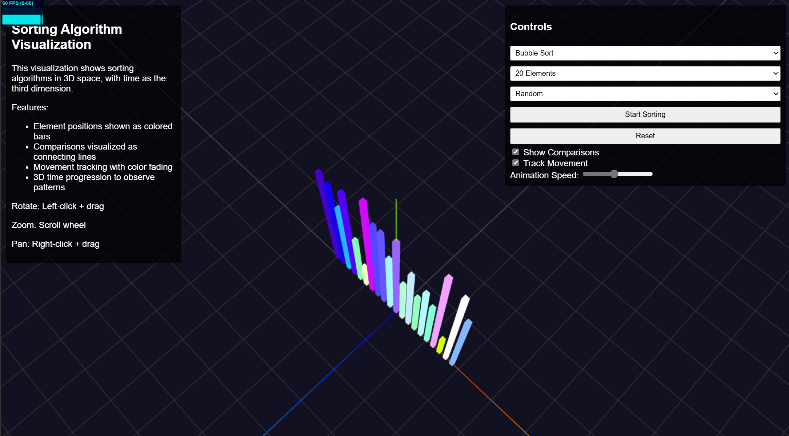

# Data Experiments

A collection of interactive 3D data visualizations and experiments for pattern analysis and machine learning research.



## Overview

This repository contains interactive web-based visualizations that render data and algorithms in innovative ways, primarily using 3D space to reveal patterns that might not be apparent in traditional 2D representations. These visualizations are designed to explore how visual pattern analysis could potentially inform machine learning approaches to algorithm optimization and data understanding.

## Current Visualizations

### 3D Sorting Algorithm Visualizer

Renders sorting algorithms in 3D space, with time as the third dimension (Z-axis). This approach reveals spatial patterns in how different sorting algorithms operate over time.

### 2D Sorting Algorithm Visualizer

A more traditional view showing sorting algorithms step-by-step. Each row represents the state of the array after an operation, scrolling downwards as the sort progresses. Useful for observing the sequence of comparisons and swaps directly.

### 2D & 3D Grid Path-Finding Visualizers
Interactive grids that let you step through **BFS**, **DFS** and custom
search code.  A built-in code editor (Ace/Monaco) lets you tweak the
algorithm live in JavaScript *or* Python (via Pyodide + WASM).  The 3-D
view uses **Three.js GridHelper** with a post-processing bloom pass for a
subtle neon-glow aesthetic. 🔦

### 2D Pathfinding Algorithm Visualizer
A dedicated visualization for pathfinding algorithms on a 2D grid. Features multiple algorithms including **Breadth-First Search**, **Depth-First Search**, **Dijkstra's Algorithm**, **A* Search**, and **Greedy Best-First Search**. Includes interactive controls for placing walls, moving start/end points, and generating random mazes.

**Features:**
- **3D Time Progression**: Watch sorting algorithms evolve along the Z-axis
- **Multiple Algorithms**: Bubble Sort, Insertion Sort, Selection Sort, Quick Sort, Merge Sort, Radix Sort
- **Correctness Coloring**: Elements are colored based on their value and proximity to correct positions
- **Comparison Tracking**: Visualizes which elements are compared (3D: arcs, 2D: outlines)
- **Movement Tracking**: Shows how elements move (3D: arcs, 2D: outlines)
- **Interactive Controls**: Adjust visualization parameters in real-time
- **Smart Camera**: Camera follows the sorting progression for optimal viewing
- **Pathfinding Visualization**: Interactive grid for visualizing pathfinding algorithms
- **Multiple Pathfinding Algorithms**: BFS, DFS, Dijkstra's, A*, and Greedy Best-First Search
- **Maze Generation**: Create random mazes with adjustable wall density
- **Interactive Grid**: Click to place walls, drag to move start/end points

## Machine Learning Potential

These visualizations are created to explore the potential for machine learning to identify patterns and optimize algorithms:

- Visual patterns in algorithm execution could be learned by ML models
- Element movements and comparison patterns might be predictive of algorithm efficiency
- ML could potentially classify algorithms based on their visual execution traces
- The visualizations could help identify opportunities for algorithm optimization

## Getting Started

### Prerequisites

- A modern web browser with WebGL support

### Running Online

The visualizations are also available online:

- [Data Experiments](https://konradish.github.io/data_experiments)

### Running Locally

1. Clone the repository:
   ```
   git clone https://github.com/yourusername/data_experiments.git
   ```

2. Open any of the HTML files in your web browser.

No build process or dependencies required! The visualizations use Three.js loaded via CDN.

## Using the Sorting Visualizers

1.  Open `3d_sorting_visualizer.html` or `2d_sorting_visualizer.html` in your browser.
2.  Select a sorting algorithm from the dropdown.
3.  Choose the number of elements and data pattern.
4.  Click "Start Sorting" to begin the visualization.
5.  **3D View:** Use your mouse (Right-drag: Rotate, Scroll: Zoom, Left-drag: Pan) to explore.
6.  **2D View:** The visualization scrolls down automatically.
7.  Adjust animation speed with the slider.
8.  Toggle comparison and movement visualizations with the checkboxes.

## Contributing

Contributions are welcome! Feel free to submit pull requests for new visualizations, enhancements to existing ones, or machine learning integrations.

1. Fork the repository
2. Create your feature branch (`git checkout -b feature/amazing-viz`)
3. Commit your changes (`git commit -m 'Add some amazing visualization'`)
4. Push to the branch (`git push origin feature/amazing-viz`)
5. Open a Pull Request

## Future Visualization Plans

- Graph algorithm visualizations
- Neural network training progression in 3D
- Data clustering visualizations
- Decision tree growth patterns
- Optimization algorithm search space exploration

## License

This project is licensed under the MIT License - see the [LICENSE](LICENSE) file for details.

## Acknowledgments

- Three.js for 3D rendering capabilities
- Inspired by discussions about ML applications in visual pattern analysis
